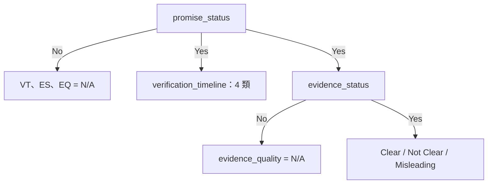

# NTCIR-19 AI CUP Special Session 論文計畫（修訂版）

> 更新日期：2026-08-12  
> Working title：**Hierarchy-Constrained Decision Calibration and Decoding for Multi-Task ESG Promise Verification**  
> 中文暫譯：**階層約束下的多任務 ESG 承諾驗證：決策校正與聯合解碼**

## 0. 本版的研究定位

本論文主線聚焦於一個可受控驗證的研究問題：

> 在四個輸出具有硬性階層關係的 ESG 承諾驗證任務中，應如何在**決策校正**與**解碼**階段利用標籤約束？這些效果在「已見來源報告、未見當前段落」與「整份來源報告皆未見」兩種情境下是否一致？

| 項目 | 本版決定 |
|---|---|
| 論文主角 | 階層約束的 class-bias decision calibration 與 17-state decoding |
| 主要證據 | 固定同一組基礎模型機率，受控比較不同決策規則 |
| 主要科學評估 | train/calibration/test 三方互斥的 rotating cross-fitting，分別在 same-document 與 document-disjoint 設定下評估 |
| 雙評估設定 | row split 測量「已見來源報告、未見當前段落」，PDF-disjoint split 測量「整份來源報告皆未見」；前者也符合競賽 test 分布，兩者回答不同問題，不是「有偏 vs 無偏」 |

在結果完成前，只使用下列不預設勝負的核心敘述：

> We conduct a controlled study of hierarchy-constrained decision rules for multi-task ESG promise verification, comparing independent prediction, deterministic projection, metric-aware class-bias calibration, and valid-state decoding under cross-fitted evaluation.

---

## 1. 投稿場次、格式與待確認事項

### 1.1 已確認的 NTCIR-19 一般規定

依 NTCIR-19 participant paper author instructions（2026-08-03 查核）：

| 項目 | 規定／目前作法 |
|---|---|
| 語言 | 英文 |
| 模板 | NTCIR-19 官方提供的 ACM Master Article / proceedings sample |
| 長度 | **最多 8 頁，包含參考文獻** |
| Draft deadline | **2026-08-31**——當日交給 **AI CUP 負責人**彙整，不是自行投稿 |
| Camera-ready deadline | **2026-11-01** |
| 匿名審查 | 不匿名；作者資訊照常填寫 |
| 標題 | 不須含 task name 或 team name |
| 資料要求 | 明確使用、分析 ESG 競賽資料集，說明應用方式與研究結果 |
| 程式碼 | 非格式上的強制項，但應提供可重現版本與固定 commit/tag |

參考連結：

- [NTCIR-19 Author Instructions](https://research.nii.ac.jp/ntcir/ntcir-19/papers.html)
- [主辦單位來信所附的 NTCIR-18 範本頁](https://research.nii.ac.jp/ntcir/ntcir-18/papers.html#author)

---

## 2. 任務結構與研究問題

### 2.1 四個任務不是互相獨立

每筆文字要預測：

- `promise_status`（PS）：Yes / No
- `verification_timeline`（VT）：already / within_2_years / between_2_and_5_years / more_than_5_years / N/A
- `evidence_status`（ES）：Yes / No / N/A
- `evidence_quality`（EQ）：Clear / Not Clear / Misleading / N/A

依任務定義，合法輸出須滿足：

1. `PS=No` → `VT=ES=EQ=N/A`。
2. `PS=Yes` → VT 必須是四種實質時程之一，ES 必須是 Yes 或 No。
3. `ES=No` → `EQ=N/A`。
4. `ES=Yes` → EQ 必須是 Clear、Not Clear 或 Misleading。

因此笛卡兒積雖有 `2 × 5 × 3 × 4 = 120` 種組合，合法狀態只有：

```text
1 + 4 × (1 + 3) = 17
```



目前資料盤點顯示：2,000 筆已標註 development data 中只出現 17 種合法狀態的 15 種，`Misleading` 僅 2 筆。定稿前須由固定資料 checksum 的分析腳本重新產生所有 support，不能手抄數字。

### 2.2 Research Questions

**RQ1 — Decision calibration**  
相較於 independent argmax 與一般 global class-bias tuning，只在語意有效子集估計下游類別偏置的 hierarchy-constrained calibration，如何影響官方 weighted macro-F1、各欄 macro-F1 與稀有類別？

**RQ2 — Structured decoding**  
完整的 deterministic hierarchy projection 與 17-state valid-state decoding 有何差異？valid-state decoding 與 constrained calibration 是否有互補效果？

**RQ3 — Generalization across evaluation regimes**  
當模型已看過來源 PDF 的其他段落、但未看過當前 Test 段落時（same-document），各 calibration／decoding 規則的表現如何？若改為整份來源 PDF 都未見過的 document-disjoint 設定，各方法的絕對分數、相對排序與效果差異是否改變？競賽 test 與 development 共用相同的 49 份 PDF，使前一種設定同時具有競賽上的實際關聯。

此處 row 與 PDF-disjoint 是兩個不同的**評估目標**，不是「有偏 vs 無偏」；論文不得把 row split 描述為錯誤或樂觀的做法。

### 2.3 預計貢獻（結果出來後再改成肯定句）

1. 將 ESG 承諾驗證形式化為只有 17 個合法 label tuples 的 constrained multi-task classification，並完整報告資料分布與極端類別不平衡。
2. 在相同 base probabilities 下，以 cross-fitted protocol 受控比較 independent prediction、deterministic projection、global／conditional decision calibration 與 valid-state decoding。
3. 在「已見來源報告、未見當前段落」與「整份來源報告皆未見」兩種評估目標下，分別報告決策規則的表現；並說明前者因 development／test 共用相同 PDF 而與競賽設定相符。

不要在實驗前寫成「我們的方法顯著提升」、「四層效果可疊加」或「改善 Misleading」。若結果不支持，貢獻應改為實證發現或負面結果。

---

## 3. 方法設計

### 3.1 固定的 base model

主實驗使用一個固定的 shared-encoder four-head 中文預訓練模型作為 anchor，已定案為 **`hfl/chinese-roberta-wwm-ext-large`**（競賽 10 模型 ensemble 中的多數 backbone）。所有決策方法必須吃同一筆 cross-fitted probabilities，避免把 backbone 或 seed 差異誤歸因給 calibration／decoder。

**論文敘述注意**：該模型雖名為 RoBERTa，架構其實是 **BERT**，只是採用 RoBERTa 式的預訓練（whole word masking、更多語料、去掉 NSP），官方也是以 `BertModel`／`BertTokenizer` 載入。Methods 必須據實說明，不可暗示使用 RoBERTa 架構。

本文不比較 training-time masking。所有正式 runs 使用相同的 standard-loss recipe，現有 partial masked task loss 固定關閉；完整 loss 設定與其他訓練超參數在 protocol freeze 時一併凍結。

Base model 只需簡短說明：

- shared Transformer encoder（`hfl/chinese-roberta-wwm-ext-large`，24 層、hidden 1024）；
- PS、VT、ES、EQ 四個 classification heads；
- 固定 tokenizer、max length、loss weights、epochs、optimizer 與 checkpoint averaging；
- 不使用 PDF URL、company、ticker、page number 等 metadata 作主模型特徵。

### 3.2 Macro-F1 decision calibration

對任務 `t` 的類別 `c`，在 log probability 加入 class bias：

```text
z_t,c(x) = log p_t,c(x) + b_t,c
```

`b` 直接針對 calibration partition 的官方 metric 最佳化，因此英文使用 **decision calibration** 或 **metric-aware class-bias optimization**；不要稱為 probability calibration，除非另做 ECE／Brier score 並驗證機率校準。

比較兩種估計方式：

- **Global bias**：使用 calibration partition 的全部樣本估計各欄 bias。
- **Hierarchy-constrained／conditional bias**：PS 用全部樣本；VT、ES 只用 gold `PS=Yes` 的樣本；EQ 只用 gold `ES=Yes` 的樣本。

所有 bias 只能由 calibration partition 學習，不能在同一批 OOF labels 上調好再回報同一批分數。`Misleading` 若在 calibration partition 沒有樣本，不單獨調其 bias，並在 manifest 記錄 fallback 規則。

**conditional bias 的定義域（已定案，須寫入 Methods）**：conditional 估計下，子欄的 `N/A` 在其條件子集中出現次數**恆為 0**——gold `PS=Yes` 的樣本裡 VT、ES 永遠不是 `N/A`，gold `ES=Yes` 的樣本裡 EQ 永遠不是 `N/A`。這不是稀有類，是階層的定義使然，因此 calibration 目標函數在 `b_vt,N/A`、`b_es,N/A`、`b_eq,N/A` 三個座標上完全平坦，參數不可識別。

故 **conditional bias 只定義在各欄的實質（admissible）類別上，三個結構性 `N/A` 依定義固定為 0.0**，不視為 fallback。由 `paper/labels.py::CONDITIONAL_PINNED_CLASSES` 從 17 個狀態推導，並有 unit tests 同時對狀態空間與真實資料斷言。

兩項後果必須在論文說明，不可略過：

1. **M3 不受影響**：projection 只在父欄要求時才輸出子欄 `N/A`，該情況下任何 bias 都改不了結果。
2. **M6 受影響**：state 0 `(No, N/A, N/A, N/A)` 的分數含三個子欄 `N/A` 項，其 bias 全為 pinned，而 M5 的 global bias 四項皆有估計。因此 §4.4 的 M6 vs. M5 contrast 要讀成「conditional vs. global，**包含兩者可估參數集合的差異**」——這個差異正是 conditioning 的內容，不是實作瑕疵；但若不揭露，讀者會誤以為兩者只差在估計子集。

### 3.3 兩種合法化方式

**Deterministic hierarchy projection**  
先對四欄各自 argmax／套 bias，再依父標籤完整投影：

- `PS=No` 時三個子欄全設為 N/A。
- `PS=Yes` 時 VT 不得為 N/A，ES 不得為 N/A。
- `ES=No` 時 EQ 設為 N/A。
- `ES=Yes` 時 EQ 不得為 N/A。

若父標籤要求實質類別而子欄原本 argmax 為 N/A，改選該欄最高分的實質類別。注意這比「父為 No 就向下設 N/A」的單向覆寫更完整——單向覆寫不保證 `PS=Yes` 時子欄不為 N/A，因此仍可能產出非法 tuple。主實驗前必須實作完整雙向投影並加 17-state unit tests。

**Joint valid-state decoding**  
直接在合法集合 `S` 的 17 個 tuples 中找最高分：

```text
y_hat = argmax_(s in S) Σ_t α_t [log p_t(s_t | x) + b_t,s_t]
```

主比較先固定 `α_t=1`，不讓 joint decoder 額外取得可調參數。若要調 task scales 或 state-kind biases，只能放在 calibration partition，並列成獨立 exploratory row。

主實驗需提供「固定 probabilities／固定 α、只切換 decoding rule」的乾淨入口，避免把額外可學參數的效果誤歸因給 decoder。

### 3.4 主比較矩陣

| ID | Calibration | Output rule | 合法狀態保證 | 主要用途 |
|---|---|---|---|---|
| M0 | 無 | Independent argmax | 否 | 完全無結構 baseline |
| M1 | 無 | Deterministic projection | 是 | 單測硬性合法化 |
| M2 | Global bias | Deterministic projection | 是 | 一般 metric-aware tuning |
| M3 | Conditional bias | Deterministic projection | 是 | 回答 RQ1 |
| M4 | 無 | 17-state decoder | 是 | 單測 constrained MAP decoding |
| M5 | Global bias | 17-state decoder | 是 | global calibration × decoder |
| M6 | Conditional bias | 17-state decoder | 是 | 回答 RQ1、RQ2 的組合方法 |

M0–M6 使用完全相同且固定的 base probabilities，只改變後處理階段的 calibration 與 output rule。表格以 factorial comparison 解讀，不寫成「逐層堆疊的七階段系統」。

---

## 4. 實驗 protocol

### 4.1 先凍結資料版本與 split

資料分析表至少包含：

- development／test 筆數（目前各 2,000）；
- 各欄、各類別與 17-state tuple support；
- PDF、company 數量（已驗證：development 為 49 PDFs、50 companies）；
- **development 與 test 的 PDF 重疊率**（已驗證：test 同樣是那 49 份 PDF，重疊 100%）；
- 每份 PDF 的段落數分布（已驗證：min 4、median 39、max 91）；
- 每個 split 的樣本、PDF、company 與稀有類數量；
- 完全重複或近重複文本。

上述已驗證數字仍須由固定 checksum 的分析腳本重新產生，不可手抄。

**對評估設定的直接後果**：row-level split 允許同一份 PDF 的不同段落分布在 Train、Calibration 與 Test，因此可測量「來源報告已見、當前段落未見」的 **same-document** 泛化；它不能支持「泛化到 unseen ESG reports」的宣稱，後者需要 PDF-disjoint 協定（§4.2）。由於 competition test 與 development 共用同一批 49 份 PDF，same-document 設定也與競賽資料分布相符。兩種設定並存，各自回答一個問題，不應描述成「有偏 vs 無偏」。

另已驗證 development id `10404` 與 test id `12550` 文本完全相同（全資料集中僅此 1 筆）；正式資料分析須揭露此 duplicate。

### 4.2 Document-disjoint 評估：5-way rotating three-way cross-fitting

**估計目標**：模型與決策規則在**未見過的 ESG 報告**上的表現（部署情境）。這比 same-document test 分布更嚴格，兩種設定的絕對分數不可直接視為同一估計目標。

**每個 seed 各自以 `pdf_url` 抽出自己的 5 個互斥 group folds**（已定案，見下方「seed 的作用範圍」）。對每個 seed 與 rotation `k`：

```text
Test        = fold k              （約 20%）
Calibration = fold (k + 1) mod 5  （約 20%）
Train       = 其餘三 folds         （約 60%）
```

規則：

1. 模型只看 Train；不能用 Calibration／Test early stopping。
2. epochs、LR、class weights 等在第一個正式 run 前凍結。
3. global／conditional biases 只在 Calibration 學習。
4. 若 decoder 有任何可學參數，也只能在 Calibration 學習。
5. 所有方法只在 Test 計分。
6. 五次 rotation 後，每筆資料恰好作 Test 一次；拼回完整 2,000 筆再計一次 metric。
7. 不平均五個 fold F1，因某些 folds 沒有 `Misleading`，目前 scorer 又會略過 absent labels，fold 分數不可直接相比。

固定 seeds：`42, 123, 456`。主實驗只使用凍結的 single-model anchor，禁止任何 evaluation-label-guided model selection。

這個設計不是昂貴的 5×inner nested CV，但 train、calibration、test 三方完全互斥，能避免 decision parameters 在評估 labels 上過擬合。若 calibration partition 對稀有類太小，須報 support 與 fallback，不可偷偷合併 Test。

**seed 的作用範圍（已定案）**：seed 同時決定 fold 分配與訓練隨機性，兩者刻意不拆開。因此 3-seed std 衡量的是**整條流程的變異**，不是模型對初始化的穩定度——論文措辭必須寫成前者。

採此設計的理由：全部只有 49 份 PDF，「哪幾份落在同一組」的影響很大；若 folds 跨 seed 固定，三個 seed 會一起繼承同一個切分運氣，std 反而看不出來。實測三個 seed 的 fold 0 重疊率僅 17%（PDF-group）與 22.5%（row），確認切分確實是一個真實的變異來源。

代價有二，均已接受：(1) 變異來源無法拆解——但本文沒有這個主張；(2) 單一 seed 出現異常結果時，無法立即判斷是切分還是訓練所致，只能先用 split manifest 的每折 support 排除切分嫌疑。

**方法比較不受影響**：M0–M6 的對比一律在同一 seed 內配對計算（同一組機率、同一批 Test rows，只換決策規則），算完差值才跨 seed 平均。切分隨 seed 改變只會讓絕對分數的 std 變寬，不會削弱方法間的對比；反而使結論成立於三種不同切分之上。

### 4.3 Same-document 評估：paragraph-level row split

**估計目標**：當模型已看過同一來源 PDF 的其他段落、但未看過當前 Test 段落時，哪一種 calibration／decoding 規則表現較好？這測量的是 **seen-report, unseen-paragraph** 情境下的泛化能力。

用相同 60/20/20 rotation、seeds 與凍結超參數，另建立 label-stratified row folds（同樣每個 seed 各自抽一組）。Train、Calibration、Test 的 row IDs 完全互斥，但同一份 PDF 的不同段落可以分布在三個 partitions。其用途是：

- 評估各決策規則在「來源報告已見、當前段落未見」情境下的效果；
- 與 §4.2 對照，量化兩種評估目標的差距，並檢查方法排序是否隨評估目標改變。
- 由於競賽 test 與 development 共用相同的 49 份 PDF，此設定也與競賽資料分布相符。

為使「來源報告已見」成為實際 protocol，而不只是整體資料集的描述，每個 rotation 都必須驗證：出現在 Calibration 或 Test 的每個 `pdf_url`，在 Train 中至少有一筆不同 row。若不符合就重新產生 split；manifest 同時保存此檢查結果。Test row 本身始終不得出現在 Train 或 Calibration。

Row protocol 只使用與 PDF-group protocol 相同的 fixed anchor 與 M0–M6。

**敘述紀律**：兩節差距若很大，正確的說法是「方法在跨文件情境下表現不同」，不是「row split 高估了效果」。

### 4.4 Comparison methods

本節的主要實驗就是 §3.4 定義的 M1–M6，並以 M0 作為共同 baseline。所有方法使用同一個 fixed base model、相同的 cross-fitted probabilities 與相同 Test rows；唯一改變的是 decision calibration 與 output rule，因此方法間的差異可歸因於決策階段，而不是 backbone 或訓練資料不同。

- **M0（主要 baseline）**：不做 calibration，以四欄 independent argmax 直接輸出。
- **M1–M3（projection comparisons）**：比較無 calibration、global bias、conditional bias 搭配 deterministic projection。
- **M4–M6（valid-state comparisons）**：比較無 calibration、global bias、conditional bias 搭配 17-state decoding。

主要 contrasts 預先定義為：M1 vs. M0（合法化效果）、M3 vs. M2（conditional vs. global）、M4 vs. M1（decoder vs. projection）、M6 vs. M3（conditional calibration 下加入 decoder）及 M6 vs. M5（decoder 下 conditional vs. global）。本論文不另外加入不同 backbone 或其他獨立分類器作主比較。

### 4.5 指標與統計方式

**Primary metric**

- 官方 weighted macro-F1：PS 0.20、VT 0.15、ES 0.30、EQ 0.35；以官方／repo scorer 為單一實作來源。

**Secondary metrics**

- 四個 field macro-F1。
- 每類 F1 與 support。
- 17-state tuple exact-match accuracy。
- raw invalid-tuple rate；M1–M6 應為 0，否則視為 implementation bug。
- conditional F1：VT、ES 在 gold `PS=Yes` 子集；EQ 在 gold `ES=Yes` 子集。

**Uncertainty**

- 每個 seed 先拼接五個 Test folds後算一個整體分數，再報 3-seed mean±std；std 是 seeds 間變異，不是 fold std。由於 seed 同時決定切分與訓練隨機性（§4.2），此 std 代表整條流程的變異，不得描述成模型穩定度。
- 主要方法差異用 paired PDF-cluster bootstrap（10,000 次）：每次以 PDF 為單位重抽、在相同抽樣上計算兩方法差值，最後對三個 seeds 的差值取平均，報 95% CI。
- 若同時檢驗多個預先指定 contrasts，使用 Holm correction；不要在大量事後比較中挑顯著結果。
- `Misleading` 只有 2 筆，只報逐例結果與排除這 2 筆後的 sensitivity metric，不做該類顯著性宣稱。

### 4.6 最小 GPU／CPU 實驗量

| 優先級 | 實驗 | 成本 | 決策 |
|---|---|---:|---|
| P0 | PDF-group fixed anchor：3 seeds × 5 rotations | 15 fits | 必做；M0–M6 皆由同一機率做 CPU 評估 |
| P1 | Row-stratified fixed anchor：3 × 5 | 15 fits | 回答 RQ3；時間不足則降為 single-seed diagnostic，M0–M6 仍全部做 CPU 評估 |

M0–M6、bootstrap 與 sensitivity analysis 都是 CPU 工作，但前提是原始 probabilities、labels、split IDs 與參數完整保存。

---

## 5. 預先定義的結果表與圖

### Figure 1 — Task hierarchy and decision routes

一張圖同時呈現：

1. 四欄依賴與 17 個合法狀態；
2. base probabilities；
3. global／conditional bias 的替代路徑；
4. independent、projection、valid-state decoding 的替代路徑。

不要畫成所有模組都依序啟用的「四層架構」，因為主實驗是互斥方法比較。

### Table 1 — Dataset and split statistics

Development／test、各類 support、合法 tuple 數、PDF／company 數，以及 row／PDF-group folds 的統計。`Misleading=2` 必須醒目註記。

### Table 2 — Controlled decision comparison（主表）

| ID | Calibration | Decoding | Weighted F1 | PS | VT | ES | EQ | Tuple Acc. | Invalid % |
|---|---|---|---:|---:|---:|---:|---:|---:|---:|
| M0 | None | Independent | TBD | TBD | TBD | TBD | TBD | TBD | TBD |
| M1 | None | Projection | TBD | TBD | TBD | TBD | TBD | TBD | 0 |
| M2 | Global | Projection | TBD | TBD | TBD | TBD | TBD | TBD | 0 |
| M3 | Conditional | Projection | TBD | TBD | TBD | TBD | TBD | TBD | 0 |
| M4 | None | 17-state | TBD | TBD | TBD | TBD | TBD | TBD | 0 |
| M5 | Global | 17-state | TBD | TBD | TBD | TBD | TBD | TBD | 0 |
| M6 | Conditional | 17-state | TBD | TBD | TBD | TBD | TBD | TBD | 0 |

每格主要分數為 seed mean±std；表下注明相對 M0／最接近 baseline 的 paired Δ 與 95% CI。只有結果支持時才在正文稱 M6 為 proposed method。

### Table 3 — Same-document vs. document-disjoint evaluation

| Method | Same-document (row) | Document-disjoint (PDF) | Δ | PDF-bootstrap 95% CI |
|---|---:|---:|---:|---:|
| M0 | TBD | TBD | TBD | TBD |
| Best calibrated projection | TBD | TBD | TBD | TBD |
| Best valid-state decoder | TBD | TBD | TBD | TBD |

表下必須註明：左欄測量「已見來源報告、未見當前段落」，右欄測量「整份來源報告皆未見」；competition test 與 development 共用同一批 49 份 PDF，因此左欄也與競賽資料分布相符。**Δ 是兩個評估目標之間的差距，不是偏誤量**。

---

## 6. 可重現性與程式修改清單

### 6.1 每個正式 run 必須保存

- git SHA、資料 checksum、執行時間與硬體。
- 完整 config、CLI、seed、train/calibration/test row IDs 與 PDF IDs。
- Hugging Face model name 與精確 revision。
- 每一列 cross-fitted probabilities 與 predictions。
- class biases、fallback 與 decoder config。
- stdout/stderr log、checkpoint 選擇規則與 artifact checksums。
- 由單一 evaluation script 產生的 JSON／CSV tables，避免人工抄分數。

artifact 的版控規則：`splits/`、`results/` 與 `probs/` 都進 git（`probs/` 每個 rotation 僅 72 KB、30 個共約 2.1 MB，進 git 可省去 B 到 A 的傳輸環節，並讓整份研究從 clone 就能重現）；`predictions/` 只收 `.csv.gz`；模型權重（每個 rotation 約 1.3 GB）不進 git，改以 release archive／可追蹤儲存保存，checksum 記在 bundle 的 `meta.json`。

在 GPU 產出正式機率前，A 使用具已知預期輸出的 synthetic probability fixtures smoke-test M0–M6。主表數字一律只能來自新 protocol 的 cross-fitted probabilities。

### 6.2 主實驗前的必要程式工作

- [x] 新增固定 PDF-group 與 row-stratified rotating split 產生器；row protocol 必須驗證每個 Calibration／Test PDF 在 Train 皆有其他 row，並將檢查結果寫入 manifest。
- [ ] 新增完整 17-state validator 與 projection unit tests。
- [ ] 將 calibration API 改為明確接收 calibration labels，拒絕 Test labels。
- [ ] 將 joint decoder 拆成固定 probabilities／固定 scales 的乾淨模式。
- [ ] 把需手動改 Python 常數的實驗改成 CLI／config，避免 run 間污染。（split generator 已有 CLI；訓練與評估尚未）
- [ ] 建立 `run_manifest.json` 與一鍵重算 tables 的指令。
- [ ] 建立只涵蓋 controlled study 的英文 README，從乾淨環境驗證至少一條 inference／evaluation command。（README 已建立；乾淨環境驗證尚未做）

完成前不要在論文寫「repository is fully reproducible」。

---

## 7. 四人分工

**分工原則**：GPU 只有一張、由 **B 一人操作**，P0 的 15 fits 是序列的關鍵路徑——**加人不會讓 GPU 變快**。因此其餘三人全部配置在非 GPU-bound 的工作（infrastructure、evaluation code、統計、寫作、稽核），目標是讓 GPU 一開跑就不再被任何人擋住。

**去耦合原則**：四個人之間**只透過檔案格式交接，不透過對話交接**。工作流本質上是 `資料 → splits → 訓練 → 機率 → 評估 → 統計 → 寫作` 的序列，無法消除；但只要介面先定死、每個人都有可用的替代輸入，就沒有人需要停下來等別人。寧可某人某週閒置或超載，也不要出現互相等待。

### 介面契約（A 制定）

**格式規格一律以 [`docs/interface_contract.md`](interface_contract.md) 為準**，本節不重複描述檔案格式——兩處各寫一份必然分岔，而分岔的代價是有人照著過期的規格交件。本節只定義四條交接線是誰對誰、以及上游未到時各自可以先做什麼。

| 交接 | 產出者 | 消費者 | 上游未到時的替代輸入 |
|---|---|---|---|
| Splits | A | B | B 先用亂數 split 跑 smoke test |
| Probabilities | B | A | A 用 synthetic probability fixtures 除錯 |
| 評估結果 | A | C | C 用**合成 results 檔**驗證統計腳本 |
| 表格與圖 | C | D | D 先用 placeholder 表格排版 |

**責任歸屬**：由 **A 單一制定**——A 產出兩個契約、消費一個，接觸面最廣，且契約是 protocol freeze 的上游，同一條責任線較清楚。不採共同討論：格式設計交給委員會只會拖延，且容易沒人真正負責。

A 的交付物是**規格 + 每個契約的範例檔**——範例檔才是真正解鎖他人的東西，有了它 C 當天就能用假資料把統計與表格程式寫完測好。

凍結後任何修改須經 A 同意並更新契約文件。凍結完成後，每個人只對著格式工作，不必等別人交件。

### A：方法實作與評估

實作論文要研究的方法（M0–M6），並產出評估結果。純 CPU 工作，不需要 GPU。

- 制定介面契約與範例檔，8/5 凍結。
- Split generator（PDF-group 與 row-stratified rotating）、`run_manifest.json`、一鍵重算 tables；generator 一律輸出每折 support、rare-class fallback 與 same-document overlap validation。邏輯 8/3–8/4 先寫，8/5 後才接契約格式。
- Calibration API 改為只接收 calibration labels、拒絕 test labels；實驗參數改成 CLI／config。
- 補齊完整 17-state projection 與 validator 並加 unit tests（單向的「父為 No 就向下設 N/A」不保證 `PS=Yes` 時子欄不為 N/A）。
- 實作 17-state joint decoder，提供「固定 probabilities、固定 α、只切換 decoding rule」的乾淨比較模式。
- 跑 M0–M6，交付 `results/*.json`。第一週先用 synthetic probability fixtures smoke-test，不必等 GPU。
- **負責 8/6 protocol freeze gate**；freeze 後 protocol 程式修改須經 A 簽核。

### B：GPU 與 artifact custodian

GPU 機器的唯一操作者。所有訓練 run 與 artifact 保管都經由 B，避免多人同時操作造成環境、checkpoint 或 cache 污染。

- 執行 PDF-group 與 row-stratified fixed-anchor runs，保存 §6.1 要求的所有 artifacts、logs、checksums。
- 決定是否啟用第二張 GPU（HANDOFF 記載 3090 位於 `nvidia-smi` index 1，暗示尚有 index 0）；若可用，P0／P1 可平行，wall-clock 減半。

### C：資料稽核、統計與圖表

- 資料／support／duplicate audit，產出 Table 1（`Misleading=2`、dev/test PDF 重疊 100% 須醒目註記）。
- 檢查那 2 筆 `Misleading` 落在哪些 PDF，判斷 PDF-group 切分後是否任何 calibration partition 都看不到它。此項為**事後驗證**，不阻擋 A 的 split generator（generator 自身會輸出每折 support）。
- PDF-cluster bootstrap、Holm correction、sensitivity、per-class 與 conditional metrics。
- Figure 1、Table 1–3；**所有數字由 script 生成，不手抄**。

### D：寫作與投稿統籌

- 建立官方 NTCIR-19 LaTeX skeleton，全程控管 8 頁上限。
- 撰寫 Introduction、Related Work、Methods；維護 claim–evidence 對照表。
- 統一術語：decision calibration、projection、valid-state decoding、same-document／document-disjoint。
- 作者資訊、引用、controlled-study release、英文 README、最終 PDF QA。

### 全員共同負責

- 結果凍結後逐句檢查每個比較級、`significant`、`robust` 與數字是否有對應證據。
- 每週固定同步一次；§8 的各個 gate 由全員共同確認是否通過。
- 並行最大的風險是 freeze 後有人動到共享程式：**8/23 results freeze** 之後，除可重現性修正與明確 bug 外不得再改任何程式。

---

## 8. 四週排程（目標 8/29 交件，deadline 8/31）

**Deadline 說明**：8/31 當日要把論文交給 AI CUP 負責人彙整，因此 8/29 完成等於留兩天給對方處理與可能的回覆修正，不是單純的自我緩衝。

**與原 9/1 版的差異**：交件日提前到 8/29，results freeze 由 8/27 提前到 **8/23**，等於少四天實驗時間。若 GPU 落後，P1（row protocol）降為 single-seed diagnostic。主表 M0–M6 與 P0 不可壓縮。

每格標註該週的**外部依賴**：`獨立` = 完全不需要別人交件；`(替代:…)` = 上游未到時改用的輸入，因此仍不會停工。

| 週次 | A：方法實作與評估 | B：模型訓練（GPU）| C：統計、稽核與圖表 | D：論文撰寫 | 週內 Gate |
|---|---|---|---|---|---|
| **W1**<br>8/3–8/9 | `獨立`<br>split generator（含每折 support 與 fallback）；17-state projection + validator + unit tests；decoder 乾淨模式；`run_manifest.json`；用 synthetic fixtures 把 M0–M6 管線完整除錯 | `(替代: 亂數 split)`<br>確認第二張 GPU；跑一個 rotation smoke test；**8/7 起 P0 開跑** | `獨立`<br>資料／duplicate audit（只需資料集）；Table 1 初版；**寫完 bootstrap／Holm／per-class 腳本並用合成 results 驗證** | `獨立`<br>NTCIR-19 LaTeX skeleton（8 頁上限）；Task formulation 與 Intro 骨架 | **8/5：介面契約凍結**（A 制定，B·C·D 各簽核自己消費的那條）<br>**8/6：protocol freeze**（A）<br>8/9：P0 已啟動 |
| **W2**<br>8/10–8/16 | `(替代: synthetic fixtures)`<br>每完成一個 seed 立即跑 M0–M6；完成「一鍵重算 tables」指令 | `獨立`<br>P0 續跑（PDF-group 3 seeds × 5 rotations）；每個 fit 保存 §6.1 全部 artifacts | `獨立`<br>Table 1 定稿；Figure 1 完稿；統計腳本對合成資料的單元測試補齊 | `獨立`<br>Introduction、Related Work 完稿；Methods 依 8/6 凍結的程式撰寫（不需任何結果）| **8/16：P0 完成** |
| **W3**<br>8/17–8/23 | `依賴 B 的 probs`<br>兩種 protocol 的 M0–M6 全部跑完；交付 `results/*.json` | `獨立`<br>P1（row protocol 3×5）；**8/23 起不再啟動任何新 run** | `依賴 A 的 results`<br>`(替代: 先用合成 results 走完全流程)`<br>Bootstrap CI、per-class、conditional metrics、sensitivity、case analysis；Table 2–3 定稿 | `(替代: placeholder 表格)`<br>Experimental Setup 完稿；Results／Discussion 骨架與所有敘述句寫完，數字留空 | **8/22：主要數字完成**<br>**8/23：results freeze**（依 §9 定案題名）|
| **W4**<br>8/24–8/29 | `獨立`<br>可重現性收尾：code tag、README 英文化、乾淨環境驗證一條指令。**本週不阻擋任何人** | `獨立`<br>封存所有 artifacts 與 checksums | `獨立`<br>由凍結後的 artifacts 重算全部表格，交付最終 `tables/*.tex` | `依賴 C 的 tables`<br>全文合併、8 頁壓縮、claim–evidence audit、引用與作者資訊、PDF QA | **8/26：full draft**<br>**8/28：submission candidate**<br>**8/29：交給 AI CUP 負責人** |

### 只有三個真實等待點

其餘所有工作都可平行。這三處各自都有替代輸入，**沒有任何一處會讓人整週停工**：

| # | 等待 | 何時發生 | 中和方式 |
|---|---|---|---|
| 1 | B 等 A 的 splits | W1 前段 | 契約 8/5 定案後 B 即可寫執行腳本；真實 splits 未到就用亂數 split 跑 smoke test |
| 2 | A 等 B 的 probabilities | W2–W3 | A 全程用 synthetic probability fixtures 除錯，真實機率一到只是換輸入路徑 |
| 3 | C 等 A 的 results | W3 | C 在 W1–W2 就用**合成 results 檔**把統計、bootstrap、表格生成全部跑通 |

D 直到 W4 才需要 C 的表格，且 W3 起就用 placeholder 排版，因此 D 全程視同獨立。

### Loading 分布（刻意不均，優先保證不互相等待）

| | W1 | W2 | W3 | W4 |
|---|---|---|---|---|
| A | **重** | 中 | 中 | 輕 |
| B | 中 | 輕（多為等 GPU）| 中 | 輕 |
| C | 中 | 輕 | **重** | 中 |
| D | 中 | 中 | 中 | **重** |

W2 的 B 與 C 相對空閒：B 可先把 W4 的封存腳本寫好，C 可先做 case analysis 的候選樣本挑選。兩者都不影響他人。

### Gate 判準

- **8/6 protocol freeze**：split manifest、seeds、base config、evaluation script 全部凍結；此後改動須經 A 簽核並記入 manifest。
- **8/16 P0 完成**：未完成則立即把 P1 降為單 seed diagnostic，保住 W3 的統計與寫作時間。
- **8/22 主要數字完成**：Table 2 全格有數字（含 CI）。未達成則啟動 §9 的降級選項。
- **8/23 results freeze**：不再有任何新 run、新 search、新 tuning；之後數字只能重算，不能改變。
- **8/28 submission candidate**：四人各自完整讀過全文一次，claim–evidence 對照無缺口。
- **8/29 交給 AI CUP 負責人**（deadline 為 8/31）；8/30–8/31 只保留給對方回覆的修正需求，不列為工作日。

### 落後時的處置順序

依序放棄，不得跳過順序去砍前面的項目：

1. P1 降為 single-seed diagnostic → RQ3 改為 diagnostic，明列為限制。

**不可壓縮**：P0 的 15 fits、M0–M6 主表、bootstrap CI、8/23 results freeze。

---

## 9. 結果導向的題目決策

在 8/23 results freeze 時依結果選最誠實的題名與主張：

1. **Conditional calibration／decoder 有穩定增益**：保留目前 working title，主張方法與交互作用。
2. **方法增益小，但 same-document→document-disjoint 落差大且穩定**：改題為 *How Far Do ESG Promise Verification Systems Transfer? Same-Document versus Document-Disjoint Evaluation*，把兩種評估目標的對照升為主貢獻。
3. **兩者都沒有穩定證據**：改成 empirical analysis paper，題名聚焦 constrained decision rules 的負面或不確定結果，不製造新方法宣稱。

這三條都是可投稿的結果；不能為了保住原題而選擇性隱藏不利實驗。

---

## 10. 投稿前檢查清單

### 實驗與數字

- [ ] M0–M6 使用相同 base probabilities 與相同 Test rows。
- [ ] Train／Calibration／Test 完全互斥；PDF-group 主結果無跨 split PDF。
- [ ] 每 seed 以完整拼接 OOF 計分，不平均 fold F1。
- [ ] 所有 tuned parameters 只使用 Calibration labels。
- [ ] 報 per-class support、invalid rate、tuple accuracy 與 paired PDF-bootstrap CI。
- [ ] `Misleading=2` 沒有顯著性或穩定改善宣稱。

### 寫作與格式

- [ ] 使用正式 NTCIR-19 template，全文含 references ≤ 8 pages。
- [ ] Abstract 最後一版才填結果，不放未驗證形容詞。
- [ ] Introduction 的每項 contribution 都能指到一張表／一段分析。
- [ ] Figure 1 呈現替代 decision routes，不假裝是四層全開架構。
- [ ] Methods 與實際程式逐項一致。
- [ ] Discussion 主動說明 small data、rare class、PDF split assumptions、未比較 training-time structural objectives 與 duplicate 限制。
- [ ] 官方資料集與 overview paper 的引用完整。

### 可重現性

- [ ] 固定 code tag／commit、data checksum、model revision、seeds 與 split manifest。
- [ ] probabilities、predictions、biases、decoder params、logs 與表格產生檔已封存。
- [ ] Controlled-study README 英文化，乾淨環境重跑至少一條公開 command。
- [ ] 最終 PDF、controlled-study release 與文中數字交叉核對完成。

---

## 附錄：程式現況與論文敘述的對照警告

| 論文需要的元件 | 現況 | 待處理 |
|---|---|---|
| Rotating split generator（PDF-group 與 row-stratified） | ✅ `paper/splits.py`，六個 manifest 已產出 | — |
| 固定的 base model（four-head、standard loss） | ✅ `paper/model.py`、`paper/train_fold.py`，ablation 開關已移除 | 尚無驅動腳本把訓練串起來；backbone 待定案 |
| 完整 17-state projection 與 validator | ⬜ 未實作 | 須為雙向投影，並加 17-state unit tests |
| Calibration-only class-bias API | ⬜ 未實作 | 只接收 calibration labels、拒絕 test labels，並保存 fallback／biases |
| 17-state joint decoder | ⬜ 未實作 | 須提供「固定 probabilities、固定 α、只切換 decoding rule」的乾淨比較模式，不夾帶額外可調參數 |
| M0–M6 與評估輸出 | ⬜ 未實作 | 依賴上面三項 |

任何論文敘述以**正式凍結後的程式與 manifest**為準，不以 README、舊 log 或開發時記憶為準。
